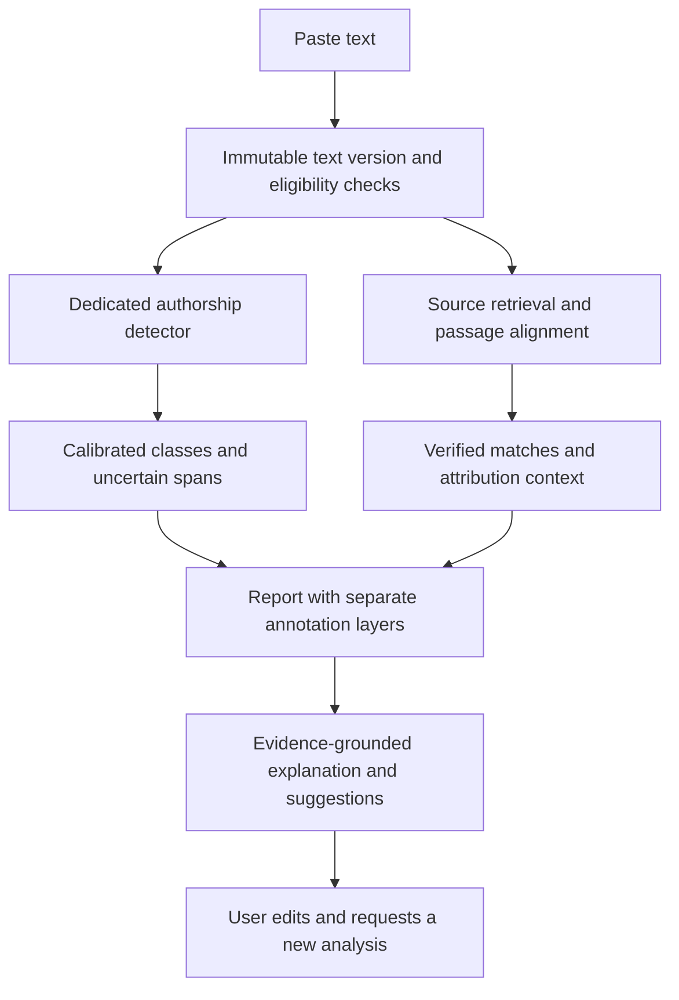

# TuringTint detector-only product and research plan

Research date: 2026-09-27. Status: proposed implementation plan, not measured product performance.

Latest operating constraint: the user will monitor while the assistant performs the work using free/local components. The [autonomous feasibility assessment](autonomous-feasibility.md) supersedes assumptions below about recruiting human reviewers and calendar estimates dependent on them. Existing provenance-supported datasets replace new human collection as the active prototype path; mixed-workflow and human-usefulness claims remain bounded by available evidence.

## 1. Decision and scope

The active direction is a web application that accepts pasted prose, highlights authorship signals and source matches, explains the evidence, and suggests justified editorial improvements. This supersedes the paraphraser, rewrite-training, and detector-score-minimization objectives. Preserve previous experiments as historical artifacts; do not delete or relabel their provenance.

Confirmed first-release audience: English academic and student writing, explicitly selected by the user. Prioritize essays, assignments, research paragraphs and academic prose, including Indian and non-native English, in collection and evaluation. Validate paragraphs of different lengths; do not quietly substitute long-document performance for paragraph performance. The user prefers open-source/local only: the active prototype has no paid detector, plagiarism or hosted LLM dependency. Commercial services below are research references or deferred alternatives, not planned integrations.

Recommended approach: benchmark locally runnable detector checkpoints and a small encoder baseline; build source matching against user-supplied documents and a licensed local academic corpus. Begin with deterministic evidence explanations; evaluate an optional local LLM for richer guidance. Adapt a classifier only after the benchmark identifies a measurable weakness. Check code, weights and dataset licenses separately before selecting components.

The defensible promise is useful, calibrated evidence within a published scope. Pasted text alone does not establish exact writing history or prove that each word came from a human or AI.

## 2. What the research changes

| Evidence | Finding and limitation | Product decision |
|---|---|---|
| [RAID, ACL 2024](https://aclanthology.org/2024.acl-long.674/) | A large benchmark exposes sensitivity to unseen generators, domains, decoding and attacks. | Include all these conditions in evaluation; random splits are insufficient. |
| [GenAI shared task, 2025](https://aclanthology.org/2025.genaidetect-1.45/) | Reports over 99% performance on machine examples at 5% human false-positive rate with a fixed set of generators/domains seen during training. | Detection can work well in a defined setting. This is neither 99% general accuracy nor an acceptable default human false-positive rate. |
| [Binoculars, ICML 2024](https://proceedings.mlr.press/v235/hans24a.html) | Reports strong low-false-positive detection in its tested conditions using two related language models. | Reproduce as a statistical baseline if hardware permits; do not transfer its headline metrics to this product. |
| [SenDetEX, EMNLP 2025](https://aclanthology.org/2025.emnlp-main.268.pdf) | Context-aware sentence detection performs strongly on a selected synthetic benchmark; sparse context remains difficult. | Sentence classification needs neighboring context and its own evaluation. |
| [OpAI-Bench, June 2026 preprint](https://arxiv.org/html/2606.06481v1) | Progressive editing creates difficult mixed cases; span labels project edited sentence regions. | Collect real revision histories. Operational edit labels are not exact per-word authorship. |
| [Liang et al., 2023](https://arxiv.org/html/2304.02819v3) | Historical detectors disproportionately flagged non-native English in the study's small, specific datasets. | Audit Indian English, non-native English and polished human writing. Do not attribute historical error rates to current services. |
| [GPTZero API interpretation](https://gptzero.me/faq) | Documents human/mixed/AI classes and sentence highlights; acknowledges stronger performance with more text. | A practical baseline, requiring an independent paragraph and span evaluation. |
| [Pangram inference API](https://pangram.readthedocs.io/en/stable/api/rest.html) | Documents asynchronous results, text windows, offsets and AI-assisted classifications. | Another comparison candidate; verify the actual contracted model/version and score meanings. |
| [Crossref explanation](https://www.crossref.org/documentation/similarity-check/similarity-report-understand/) | Similarity reports locate overlap; properly cited text can have substantial overlap. | Evidence supports a review of attribution, not an automatic plagiarism verdict. |

Include the newer vendor-authored [GPTZero 2026 report](https://arxiv.org/abs/2602.13042) and [Pangram 4 report](https://arxiv.org/abs/2607.27183) in the candidate review. They motivate testing current systems rather than assuming older benchmarks describe current capability. Vendor-authored evaluations are not independent validation on our users.

A second research pass identifies useful methods rather than a requirement to use commercial services. GPTZero describes joint document/sentence supervision while acknowledging ambiguity in mixed-sentence labels. Pangram 4 reports much lower human error rates than older studies, but defines a supported prose/length scope and allows negligible AI edits within its human category. Benchmark assistance labels and provider definitions can disagree without measuring the same task. Freeze our operational definitions first, test local candidates independently, and keep explanatory associations separate from causal claims about authorship.

## 3. Product contract and interface

Paste text → eligibility check → progressive analysis → annotated paragraph and evidence panel → optional suggestions → explicit re-analysis of a new version.

Two independently toggleable layers can overlap:

| Layer | Display | Meaning |
|---|---|---|
| Authorship | AI-associated signals | A calibrated estimate, not proof of AI origin. |
| Authorship | Possible AI + human contribution | A separately evaluated mixed/editing class, not a 40–60% binary score. |
| Authorship | Human-associated signals | Evidence consistent with human writing, not certified human-only authorship. |
| Authorship | Insufficient evidence | Short/unsupported input, uncertainty, or disagreement. |
| Source matching | Underline plus source number | Retrieved overlap, its type, and attribution context. |

Use accessible colors plus text labels and a keyboard-accessible list. Source underlines can coexist with authorship backgrounds. Do not force each word into a confident class. Begin at sentence or multi-sentence span resolution; reserve exact word highlighting for verified source matches or separately validated localization.

Clicking a span shows: the selected text, class and confidence meaning, uncertainty, relevant source excerpt/link if any, and recommended action. A short explanation of prose features is not causal proof of authorship; distinguish observed editing issues from actual detector evidence.

Show three different quantities with explicit labels: document classification probabilities, the fraction of eligible text receiving each annotation, and source-overlap percentage. A 90% document AI probability does not mean 90% of the words were AI-written. Never calculate a human-written percentage as `100 - AI probability`, particularly in a three-class system.

Mixed writing has at least two distinct forms: alternating human/AI passages, and a human draft revised by AI or vice versa. Store these separately in benchmark labels even if the first interface groups them. Minor spelling correction, translation, and substantial rewriting need explicit operational definitions; they must not be silently collapsed into pure AI.

If input is too short for supported detection, still offer source matching and editorial feedback. Determine detection eligibility by length-stratified validation; there is no universal word cutoff established here.

## 4. Architecture and build-versus-buy

Proposed engineering stack: a localhost Next.js/React interface, Python/FastAPI backend, SQLite for the initial corpus/metadata index, and a local analysis worker. This fits the current Python research tooling. Framework versions are implementation choices to verify when building. Use ephemeral reports by default; accounts and multi-user hosting are later additions. Download permitted models and corpus material during setup; analysis should work offline against the installed corpus, without submitting pasted text externally.

| Option | Role | Decision rule |
|---|---|---|
| General LLM judging authorship | Cheap experiment/baseline, explanation layer | Do not use its self-reported confidence as a calibrated detector. |
| Dedicated detector API | Deferred alternative and research reference | Outside the local-only prototype; reconsider only if the user changes this preference. |
| Small encoder document classifier and context-aware sentence tagger | Primary local detector candidates | Benchmark available licensed checkpoints first; then test adaptation against the frozen local baseline. |
| Statistical method such as Binoculars | Independent baseline or optional signal | Measure incremental benefit and hardware cost before adding. |
| Multiple-detector ensemble | Optional later improvement | Retain only if ablation improves the held-out operating point; correlated errors make voting unreliable. |

Preserve raw model outputs internally with checkpoint hash/version/date and map them into an explicit internal schema. Never average unlike fields such as classification probability, assistance intensity and fraction of flagged text. Model disagreement should increase uncertainty unless a learned, validated combination establishes otherwise. The repository records an RTX 3050 with 6 GB VRAM: verify currently available hardware before running experiments. Start with compact encoder inference; do not assume two large language models fit concurrently. Benchmark CPU fallback and sequential model loading. Existing Qwen rewriting weights are not an authorship detector; evaluate a local instruction model separately for explanations.

Prototype endpoints: `POST /analyses`, `GET /analyses/{id}`, `DELETE /analyses/{id}`, and explicit `POST /analyses/{id}/suggestions`. Return independent component states such as queued, complete, partial, failed and unsupported. A failed source search must not appear as zero overlap. A timeout must not become a human classification.

Report fields: schema/model/calibration versions; text hash; supported-scope status; component status; document probabilities when available; annotation intervals and labels; confidence type; source evidence; coverage; warnings; elapsed time; and cost units. Missing values remain null with reasons.

Store immutable original text and use half-open UTF-16 offsets at the web API boundary, with explicit conversion from Python code-point offsets. Normalization requires a reverse mapping. Validate repeated sentences, emoji, combining characters and overlapping intervals. A report binds to one text hash; edits create a new version and cannot retain stale highlights.

Bind the initial application to localhost. Treat submitted text and corpus documents as untrusted data, never instructions for tools. Escape rendered content, restrict any corpus-ingestion URLs, isolate saved reports, and bound expensive scans. Operational logs should contain metadata rather than submitted prose. Disable external inference and telemetry during analysis; verify offline behavior rather than assuming locally installed software makes no network calls.

Local storage needs explicit retention and deletion controls for submitted prose and private reference documents. Any future hosted-provider option would require a separate review of retention, training use, indexing and deletion; it is not enabled by this plan.

## 5. Plagiarism and source-evidence pipeline

Start with exact and lightly modified matches against user-supplied reference documents and a small explicitly licensed academic corpus. Keep retrieval independent of AI scores. Prototype lexical retrieval with a local full-text index and token shingles, followed by passage alignment. Add licensed local embedding/cross-encoder candidates only after lexical evaluation. The [PAN source-retrieval task](https://pan.webis.de/clef13/pan13-web/source-retrieval.html) and [text-alignment task](https://pan.webis.de/clef14/pan14-web/text-alignment.html) provide useful evaluation decompositions. No whole-web plagiarism coverage is claimed. Record the corpus version, document count, provenance and searchable coverage in reports.

1. Identify language, quotations, citations and bibliography while preserving offsets.
2. Retrieve candidate sources from the explicitly bounded local corpus; preserve access permissions for private reference documents.
3. Align exact/near-exact text using normalized lexical matching and sequence alignment.
4. Later add semantic retrieval and pairwise comparison for paraphrases; same topic alone is insufficient evidence of reuse.
5. Store source ID/URL, matched excerpt, document/source offsets when available, access date, retrieval method and match type. Verify excerpts against indexed documents. Deduplicate mirrored pages; the first discovered page is not necessarily the original source.
6. Assess quotation and citation context separately from overlap.

Initial labels: verbatim match, close wording, multi-source/patchwork overlap, and citation/quotation needs review. Later experimental labels: possible paraphrased reuse, translated reuse, and self-reuse with reliable author provenance. Idea theft, intent and universal originality are outside what a pasted paragraph establishes.

Output when retrieval returns nothing: "No matching source found in the sources searched." Publish searched coverage and incomplete components. Source-absent, inaccessible-source and algorithm-failure cases are different evaluation outcomes.

Do not assume access to publisher full text through Crossref metadata. [Similarity Check eligibility](https://www.crossref.org/documentation/similarity-check/) is specific to eligible participating publishers. General search can discover candidates but is not a complete plagiarism corpus; [Brave's API documentation page](https://brave.com/search/api/) distinguishes API storage rights from rights to third-party content. Building a broad independent corpus requires separate permissions, indexing and operating work.

## 6. Dataset and independent evaluation

The [openly licensed corpus plan](open-corpus-plan.md) specifies concrete sources, release/license distinctions, local reference-library targets, acquisition order and admission metadata. It is the source-selection companion to this evaluation protocol.

Use existing project material only for development/regression cases. Old targets include AI-edited derivatives; published originals, generated text and edited targets must retain distinct labels. Ten-step rewrite training and subjective review scores say nothing about detector accuracy.

Stage A: assemble approximately 600 documented development cases: 200 human, 200 AI, and 200 mixed. Balance lengths and collect meaningful samples of the supported genres. This is for debugging and candidate selection, not a low-error public claim. Add separate development source-matching cases with known sources and hard same-topic negatives.

Stage B: reserve a separate calibration set of approximately 1,000 documents; increase it if confidence intervals or subgroup thresholds are unstable. Freeze threshold choices before final testing. Public datasets can seed training and challenge sets after license review, but cannot alone establish independence from vendor training.

Stage C: target a blind launch evaluation of at least 3,000 independent human source/author groups, 1,000 pure-AI examples, and 1,000 mixed examples. These are collection targets, not existing assets or sufficient counts for every subgroup. Related revisions stay within one group; ten paragraphs from one source do not count as ten independent human groups. Evaluate at least 500 separate source-matching cases, stratified by match type and source availability; expand rare categories before making claims.

Human data should combine provenance-supported contemporary consented writing with older licensed material, including Indian/non-native English, novice writing, polished prose, technical methods, common templates and correct quotations. Older publication date is useful provenance evidence, not a complete definition of humanity.

AI cases should record model/version/date, prompt family, sampling, source material and length. Include several generator families, alternative prompting and edits. Hold out a generator family, a domain challenge set, and a later chronological batch. A novel domain is a stress test, not automatically part of the initial supported scope.

Mixed cases need actual recorded workflows: human → AI polish; AI → human editing; alternating/inserted sentences; repeated revisions; light grammar correction; and translation. Use edit logs to mark known operations and uncertain origin. Do not manufacture human-edited ground truth by asking another LLM to impersonate a human editor.

Split by source, author, prompt lineage and all derived revisions; deduplicate both exact and near-duplicate text. Independently review labels and adjudicate ambiguous cases. Keep the locked test labels hidden during model selection; after a failure, tune on development data and use a new reserved confirmation batch.

## 7. Define high accuracy before optimizing it

The following are aspirational release gates for the supported scope, not achieved metrics. Validate feasibility, freeze gates before final evaluation, and narrow or withhold features if they fail.

| Component | Proposed gate | Required companion measurements |
|---|---|---|
| Human protection | One-sided 95% upper confidence bound on false AI-involvement flags ≤1% | Count both AI and mixed flags on genuine human text; report every supported subgroup and failure count. |
| Pure-AI detection | Recall ≥80% across all eligible pure-AI inputs | Abstentions and operational failures count as undetected; separate held-out-family and length results. |
| Useful answers | Conclusive decision coverage ≥60% overall | Report per-class/subgroup coverage and accuracy among answered cases; eligibility fixed before testing. |
| Confident AI highlights | Precision lower 95% bound ≥95% under a frozen span-matching definition | Report sentence precision/recall, character/span overlap F1, boundary error and highlighted coverage. |
| Mixed classification | Precision lower 95% bound ≥90% and recall ≥60% on recorded mixed workflows | Break out assistance vs alternating passages and edit strength; otherwise keep experimental. |
| Verified exact source matches | Precision lower 95% bound ≥98%; conditional recall target ≥90% when source is available | Also report retrieval recall@k and end-to-end recall including missing sources. |
| Explanations | Every source claim traceable to supplied evidence | Human audit of explanation correctness and usefulness; invented citations are release-blocking defects. |

Also report multiclass confusion, calibration/reliability plots, Brier score, and risk-versus-coverage curves. Use clustered intervals for correlated spans and source groups. Show false AI-only and false mixed flags separately. Never improve apparent accuracy by removing hard inputs after looking at their labels.

Fix metric denominators explicitly: human false-positive rate uses all eligible human documents, and also report it conditional on answered human documents. Pure-AI recall uses all eligible pure-AI inputs including abstentions. Report eligibility coverage over all submissions as well as decision coverage within eligible inputs. Localization needs AI-token recall across all labeled AI tokens, counting unhighlighted tokens as misses, plus document-macro summaries; highlighting one easy sentence must not pass as useful localization. Assess precision gates at representative deployment prevalence or publish prevalence-conditioned estimates, rather than silently using a balanced dataset.

For scale intuition, zero errors among about 300 independent human cases yields an approximate one-sided 95% upper false-positive bound of 1%; about 3,000 yields 0.1%. Real errors and subgroup claims require more data. A large total test does not certify each small subgroup.

Base rates matter: with 80% sensitivity and 1% false-positive rate, AI-only prevalence of 10% gives approximately 90% positive predictive value; at 1% prevalence it is approximately 45%. This illustrative binary calculation is not a claim about our future multiclass system. Publish precision across plausible prevalence levels instead of treating a balanced benchmark as the real world.

Source evaluation must distinguish retrieval failure from poor alignment. Include independent same-topic prose, common facts, technical phrases, properly cited quotations, mirrors and preprints as hard negatives. Measure over-highlighting as well as missed spans.

If sentence precision fails, ship document/paragraph evidence and verified source highlights while continuing localization research. If mixed detection fails, say insufficient evidence instead of repackaging binary uncertainty as mixed authorship.

## 8. Revision suggestions and score changes

Suggestions remain part of the detector product, not a return to full-paragraph rewriting. Each suggestion includes the exact span, identified issue, evidence, proposed action, reason and factual details that must be preserved.

| Observed issue | Suggested action | Why |
|---|---|---|
| Generic unsupported statement | Ask the author to supply their actual finding, example or analysis | Improves specificity and intellectual contribution. |
| Verbatim source overlap | Quote and cite accurately, or express an independently understood point with attribution | Addresses borrowing directly. |
| Close paraphrase without attribution | Retain the source citation and add the author's own analysis | Synonym replacement does not resolve attribution. |
| Repetition or vague wording | Remove redundancy or clarify the actual claim | Improves readability without invented facts. |
| Altered numbers, hedging or references | Preserve or restore the verified details | Protects meaning and scientific accuracy. |

The user may request a before/after rescan. Show observed score changes for the same pinned detector and supported text conditions, alongside meaning/attribution checks. Say whether the score rose, fell or stayed similar; never promise that an edit will increase a human score. An AI-generated suggestion still involved AI even if a detector subsequently scores the text as human-like.

Evaluate suggestions with blinded human review for usefulness, meaning preservation, unsupported additions and source correctness. Any detector-score experiment uses separate evaluation data and reports transfer to an unseen detector. Do not repeatedly optimize against the locked test or make a lower score the criterion for writing quality. Avoid invented personal anecdotes, arbitrary errors, or citation removal as improvement suggestions.

## 9. Iterations, deliverables and decision gates

| Iteration | Deliverable | Evidence needed to proceed | Rough effort estimate |
|---|---|---|---|
| 0: contract | Label definitions, audience, report schema, frozen evaluation protocol | Labels and supported claims are testable | 2–3 working days |
| 1: feasibility | Development corpus, local checkpoint/encoder comparison, hardware profiling, initial licensed corpus and lexical matcher | Error audit, offline operation and measured latency/memory; candidate selected by fixed criteria | 1–2+ weeks |
| 2: web prototype | Paste/analyze, two annotation layers, source cards, uncertainty, partial-result handling | Correct offsets and evidence; no fabricated demo scores | 1–2 weeks, overlapping corpus work |
| 3: calibration | Independent calibration plus blind evaluation | Document/span/mixed/source gates assessed separately | 2–4+ weeks, dominated by data and review |
| 4: suggestions | Evidence-grounded guidance and versioned rescan | Editorial usefulness and factual preservation pass review | About 1 week |
| 5: controlled pilot | Consented pilot, error reports, drift checks, rollback path | Supported user distribution matches published evaluation scope | 2+ weeks |
| 6: optional model adaptation | Context-aware encoder/tagger training and ablations | Better operating point than the frozen local baseline | Separate research track |

Estimates assume an experienced engineer with part-time ML support and available human reviewers. A local prototype with bounded source coverage may take roughly 3–5 weeks; a defensibly evaluated beta roughly 8–12+ weeks if suitable checkpoints exist. These are planning ranges, not deadlines or guaranteed accuracy. Re-estimate after the hardware and model feasibility study. Custom training, mixed-span detection and academic corpus acquisition can substantially extend them.

Measure local model download size, peak RAM/VRAM, cold/warm latency, corpus storage, indexing time and per-scan compute. Open-source/local does not eliminate hardware, curation or reviewer costs. Planning latency goals: first result p95 ≤10 seconds and complete scan p95 ≤60 seconds for supported paragraphs, subject to hardware measurements; render deterministic explanations before optional local LLM generation. Corpus coverage is a separate success measure from matcher accuracy.

## 10. Repository changes and implementation backlog

Current state: Python rewriting research only; no web app, trained authorship detector, detector benchmark or source index exists. Existing data and outputs are ignored by Git, so tracked manifests and controlled artifact storage are necessary for reproducibility.

Reuse provenance/hashing and paper grouping from `research/build_paragraph_pairs.py`, split checks from `training/prepare_paragraph_training.py` and `training/export_reviewed_paragraphs.py`, derivative labels from `research/package_revised_pairs.py`, and relevant escaping/missing-score checks from `tests/test_pilot.py`. Existing content-preservation heuristics are screening aids, not semantic certification.

Proposed new layout: `web/`, `api/`, `detector/`, `evaluation/`, and `research/detector-benchmark/`. Preserve legacy `training/` scripts and adapters as historical rewriting work. No new training run is required to begin the detector benchmark.

First implementation tickets:

1. Define versioned report and provenance schemas, including unknown states and offset conventions.
2. Build the development manifest, label guide, grouped splits and contamination checks.
3. Implement local-model adapters and replayable fixtures; record checkpoint/license/date and null scores honestly. Verify offline analysis on the available hardware.
4. Build a reproducible benchmark runner with calibration, subgroup tables, confidence intervals, coverage and cost.
5. Implement exact source evidence and independent annotation layers in the paste-text interface.
6. Run meaningful integration checks: Unicode/repeated text, overlapping highlights, HTML escaping, stale reports, timeouts, unsupported input, unavailable sources, hostile text instructions and cross-user report access.
7. Audit errors and freeze the limited beta scope before expanding mixed classification or semantic plagiarism labels.

Research and planning completed in this document do not imply that integrations, evaluation, web development or deployment have occurred. The decision journal records the pivot and plan; the background logger remains the existing mechanism for Desktop summaries.
